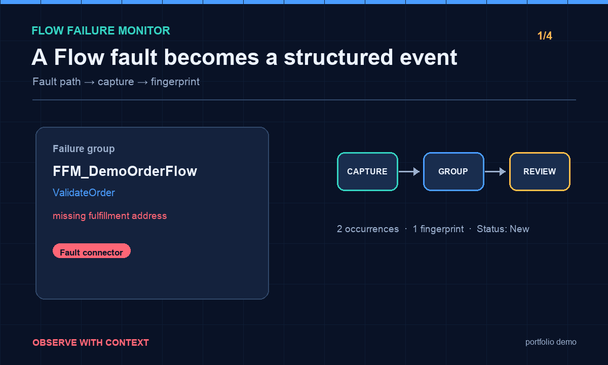
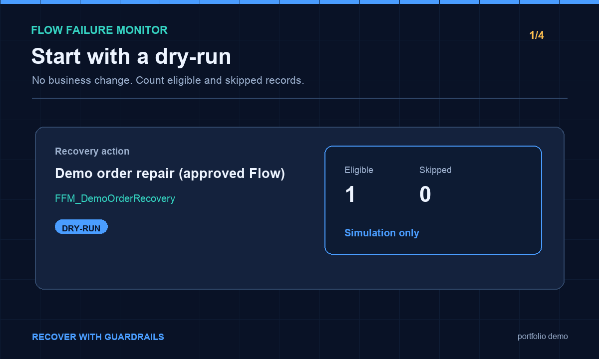

# Flow Failure Monitor

<p align="center">
  <strong>See the failure. Understand the cause. Recover safely.</strong><br />
  A Salesforce-native observability demo for Flow failures — with explicit safety gates instead of blind replay.
</p>

<p align="center">
  <a href="https://github.com/jcd1991/flow-failure-monitor/actions"></a>
  
  
  
</p>

<p align="center">
  <a href="docs/github-demo-walkthrough.md">Walkthrough</a> ·
  <a href="docs/demo-runbook.md">Runbook</a> ·
  <a href="docs/architecture-and-security.md">Architecture & security</a> ·
  <a href="docs/portfolio-readiness.md">Portfolio readiness</a>
</p>

---

## The 30-second story

When a Flow fails, the useful question is not “can we replay it?” It is:

> **What happened, what may already have changed, and what is the safest next action?**

Flow Failure Monitor captures structured fault context, groups recurring fingerprints, gives an admin a focused investigation queue, and makes recovery an explicit, reviewable decision.





_The GIFs are a sanitized storyboard of the real portfolio workflow._ The demo org walkthrough and repeatable scripts are in [`docs/github-demo-walkthrough.md`](docs/github-demo-walkthrough.md).

## Why this is safer than “retry failed Flow”

A failed Flow may already have created records, sent email, made a callout, or updated related records. A generic replay can duplicate those side effects. This project therefore uses a deliberately narrow model:

```text
Captured fault → grouped investigation → dry-run preview → explicit approval
                                                   ↓
                              one configured recovery Flow → audit result
```

The demo recovery Flow (`FFM_DemoOrderRecovery`) changes only the selected demo Account. It does not replay `FFM_DemoOrderFlow`, send email, make a callout, or touch unrelated records. A stale or invalid record is rejected before the recovery Flow is invoked.

## What you can demo

| Moment | What the audience sees | Proof in the repo |
| --- | --- | --- |
| **1 · Detect** | A Flow fault lands in the monitor with Flow, element, message, record, and fingerprint | [`scripts/e2e-flow-fault.apex`](scripts/e2e-flow-fault.apex) |
| **2 · Investigate** | Similar failures are grouped and the admin gets a troubleshooting checklist | [`docs/demo-runbook.md`](docs/demo-runbook.md) |
| **3 · Preview** | Dry-run shows eligible/skipped records without business change | [`scripts/e2e-preview.apex`](scripts/e2e-preview.apex) |
| **4 · Safety** | An invalid record is skipped and the recovery Flow is never called | [`scripts/e2e-invalid-record-execute.apex`](scripts/e2e-invalid-record-execute.apex) |
| **5 · Recover** | An approved, allowlisted Flow updates one demo record and writes audit history | [`scripts/e2e-actual-recovery.apex`](scripts/e2e-actual-recovery.apex) |

## Architecture at a glance

- **Salesforce package layer:** custom objects, fault-path invocable Apex, grouping, dashboard LWC, DTO-only bounded API, permission sets, and Apex tests.
- **MCP companion:** `flow-failure-monitor-mcp/` calls the package API; it does not embed a model or expose arbitrary SOQL/Apex.
- **Recovery boundary:** `Recovery_Action__c` names an approved Flow and its limits. Execution is explicit, audited, idempotency-aware, and never automatic.

```text
Flow fault connector
        ↓
FFM_LogFlowErrorAction → Flow_Error__c → Failure_Group__c
                                             ↓
                                  LWC / bounded API / MCP
                                             ↓
                              preview → approval → allowlisted Flow
```

## Run it locally

Requires Salesforce CLI and a Dev Hub for future managed 2GP packaging:

```bash
sf org login web --alias sflens-dev
sf project deploy start --source-dir force-app --target-org sflens-dev
sf apex run test --target-org sflens-dev --test-level RunLocalTests --code-coverage
```

For the repeatable UI demo, follow [`docs/github-demo-walkthrough.md`](docs/github-demo-walkthrough.md). For the complete detection → preview → recovery sequence, use [`docs/demo-runbook.md`](docs/demo-runbook.md).

## Package contents

- `Flow_Error__c` — structured error and resolution record.
- `FFM_LogFlowErrorAction` — invocable Apex action for Flow fault paths.
- `FFM_FlowErrorService` — dashboard queries and controlled status updates.
- `FFM_FlowFailureApiV2` — DTO-only, permission-gated REST API with strict limits and dry-run preview.
- `flow-failure-monitor-mcp/` — separate MCP companion that delegates to the API.
- `flowFailureMonitor` — Lightning Web Component dashboard.
- `FFM_DemoOrderFlow` + `FFM_DemoOrderRecovery` — packaged end-to-end demo pair.
- `scripts/` — executable Apex fixtures for the happy path and safety path.
- `docs/` — walkthrough, runbook, architecture/security notes, public test cases, and production roadmap.

The package is intentionally namespace-free in source control until the publisher chooses and registers a namespace. It does not automatically intercept every Flow: subscriber Flows must explicitly route a fault connector to `FFM_LogFlowErrorAction`.

## Security posture

The API uses a custom permission, sharing/FLS-aware queries, fixed routes, bounded pagination/date windows, field allowlists, redaction, and no arbitrary SOQL or Apex execution. The only write route is a non-executing recovery preview. Generic replay and automatic AI recovery are explicitly out of scope.

See [`docs/architecture-and-security.md`](docs/architecture-and-security.md) for the threat model and [`docs/portfolio-readiness.md`](docs/portfolio-readiness.md) for the production hardening roadmap.

## Portfolio proof

```text
✅ 6/6 Apex regression tests passed
✅ MCP TypeScript build passed
✅ npm audit --omit=dev found 0 vulnerabilities
✅ Valid recovery completed through the allowlisted demo Flow
✅ Invalid-record guard prevented Flow execution
```

This is a focused portfolio implementation: useful enough to install and demonstrate, intentionally bounded enough to explain. Production packaging still requires namespace/2GP setup, subscriber-org upgrade testing, retention controls, rate limiting, and deeper multi-user security validation.

## Package contents

- `Flow_Error__c`: structured error and resolution record.
- `FFM_LogFlowErrorAction`: invocable Apex action for Flow fault paths.
- `FFM_FlowErrorService`: read-only dashboard queries and controlled status updates.
- `FFM_FlowFailureApi`: legacy v1 bounded API.
- `FFM_FlowFailureApiV2`: DTO-only, permission-gated REST API with strict limits and dry-run preview endpoint.
- `flow-failure-monitor-mcp/`: separate read-only MCP companion that delegates to the REST API.
- `flowFailureMonitor`: Lightning Web Component dashboard.
- `FFM_DemoOrderFlow`: packaged demo Flow with a real Apex fault connector into the capture pipeline.
- `docs/demo-runbook.md`: repeatable detection → investigation → preview → safe simulation or allowlisted demo execution walkthrough.
- `docs/github-demo-walkthrough.md`: public-portfolio walkthrough for a five-minute demo.
- `docs/real-world-test-cases.md`: sanitized fixtures based on public Salesforce failure patterns.
- `docs/portfolio-readiness.md`: explicit GitHub/package publication gate.
- `docs/github-demo-walkthrough.md`: the polished five-minute portfolio walkthrough.
- `docs/architecture-and-security.md`: runtime path, security controls, and deliberate non-goals.
- Permission set and Apex tests.

This package does not automatically intercept every Flow. Salesforce Flows must explicitly route a fault connector to `FFM_LogFlowErrorAction`, which keeps the behavior visible, testable, and safe for subscribers. A reusable fault-path subflow remains a packaging follow-up. The API uses a custom permission, sharing/FLS-aware queries, bounded limits, fixed routes, redaction, and no arbitrary SOQL or Apex execution. No generic replay or automatic recovery is implemented.

## Install/develop

Requires Salesforce CLI and a Dev Hub for managed 2GP creation. Set a namespace before creating the package. Example:

```bash
sf org login web --alias sflens-dev
sf project deploy start --source-dir force-app --target-org sflens-dev
sf apex run test --target-org sflens-dev --test-level RunLocalTests --code-coverage
```

Assign `Flow_Failure_Monitor_User` for native capture/status operations, `Flow_Failure_Monitor_API_V2` for DTO read access, and `Flow_Failure_Monitor_MCP` or the preview permission set only to integrations that may create non-executing dry-run records. The hardened API base is `/services/apexrest/ffm/v2`; smoke paths are `/capabilities`, `/summary`, `/groups`, `/trends?days=30`, and `/search?q=...`. The only POST route is `/recovery/preview`, which never executes recovery.

The package is intentionally namespace-free in source control until the publisher chooses and registers a namespace.

The portfolio demo includes a controlled `FFM_DemoOrderFlow` scenario with a real fault connector, redacted failure samples, troubleshooting checklists, resolution status, dry-run accounting, a safe simulation, and one allowlisted demo recovery Flow.

## Recovery actions in plain English

The monitor does not automatically rerun a failed Flow. A failed Flow may already have created records, sent an email, made a callout, or updated related records. Rerunning it blindly could duplicate those side effects.

Instead, an administrator creates a `Recovery_Action__c` record for a safe, purpose-built repair. Think of it as a named button with guardrails:

1. Give it a label people understand, such as `Repair missing order address`.
2. Point it at a dedicated recovery Flow, such as `FFM_OrderRecovery`.
3. Set a maximum batch size and leave the action inactive until it has been reviewed.
4. The dashboard lists only active actions. The user selects one failure group, reviews the affected records, and runs a dry-run first.
5. After reviewing the eligible and skipped records, the user clicks the explicit approval/execution button.

The demo includes one real allowlisted recovery Flow: `FFM_DemoOrderRecovery`. It updates only the selected demo Account with a recovery marker. It does not replay `FFM_DemoOrderFlow`, send email, make a callout, or touch unrelated records. The demo path was tested end to end: one record previewed as eligible, job `RJ-00024` completed, and the Account description changed through the recovery Flow.

Before execution, the executor also verifies that the captured record still exists as an Account. Placeholder or deleted IDs are recorded as failed/skipped without invoking the recovery Flow, so a stale demo fixture cannot produce an opaque Flow fault.

For a sellable package, each customer action should have its own recovery Flow or Apex executor with explicit input mapping, idempotency checks, retry limits, permission checks, per-record audit results, and pause/cancel support. Generic replay remains disabled.
